# UI setup manual for the end user

This document describes how to work with the FHIR Place UI for the FHIR module deployment. While the solution aims for the best UX possible, this document serves as a assistance if needed.

## Login + Registration

The to use the application, the user needs to be logged in. From the landing page, the user can click on the "Sign In" button to access the login page.

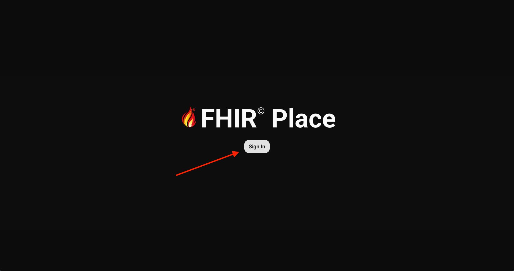

This leads to a standardized login page. After the default account has username: **admin** and password: **Admin123!**. **The user is strongly advised to change the password after the first login**

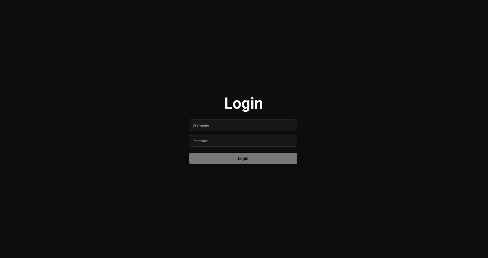

## Dashboard

After logging in, the user is presented with a main dashboard. This changes based on whether the mapping configurations already exist. If no, the page prompting the user to define them is displayed.

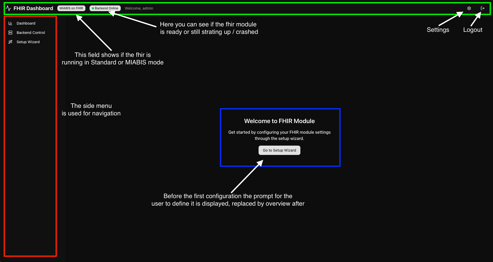

## Setup Wizard

The Setup Wizard aims to help the user define the required mappings easily. It consists of several steps that each address part of the definition, validation and sync process

### Target selection
In the first step teh user needs to specify what balze instances and formats will the created configuration target. The options visible depend on how the fhir module is set (if the endpoint for the given blaze is defined + .env variables). Based on the selection the required steps above can vary.

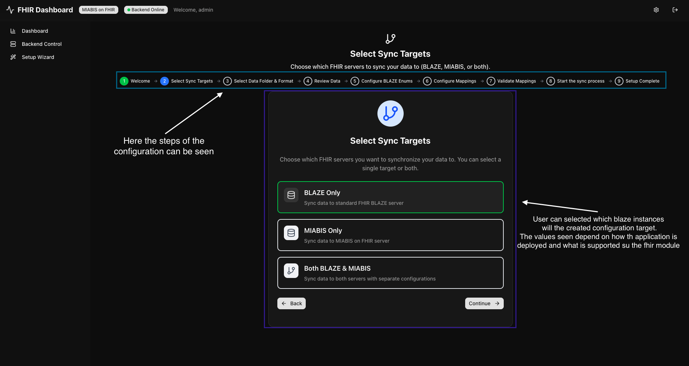

### Folder selection
In this step user must specify the **folder that contains the file for the import**. After that, the file type is automatically inferred, based of the first file in the folder. **All files must have the same format.** For CSV files a delimiter needs to be defined too.

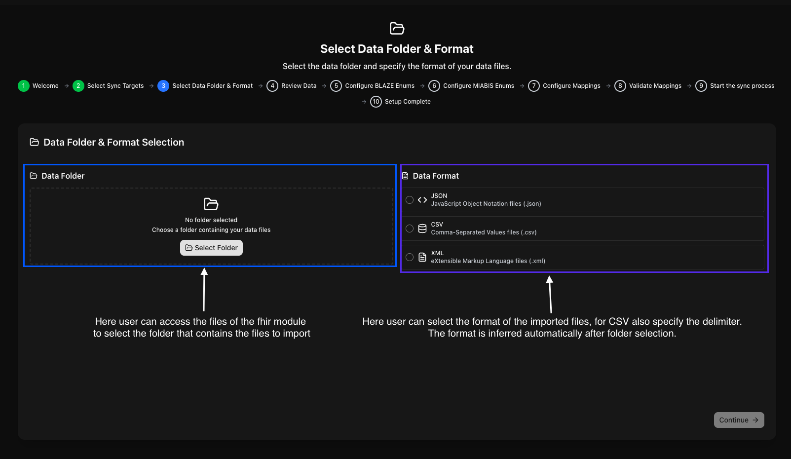

### ENUM mapping configuration
The first part of the setup process involves setting up the Temperature and Material mappings. If multiple targets are selected in the first step of the wizard, this needs to be done for each separately. As the data might not contain material or temperature values, these steps can be skipped, if the imported data do **NOT** contain information on these.

The mapping definition requires the users's output in a way that they must know what values can be found in the data they import and how they map to the standardized values in the dropdowns.

Both visual and manual/expert-mode approach are supported. The user can either define the mappings using the UI, or switch the tab to **JSON** and define/copy the mapping in a `JSON` format that is processed and the fields are populated from it. Combination of both approaches is also possible, however, when editing the JSON manually, it has to be valid before the user is allowed to continue further.

The process of mapping the Temperature and Materials is the same, example and UI explanation is shown below.
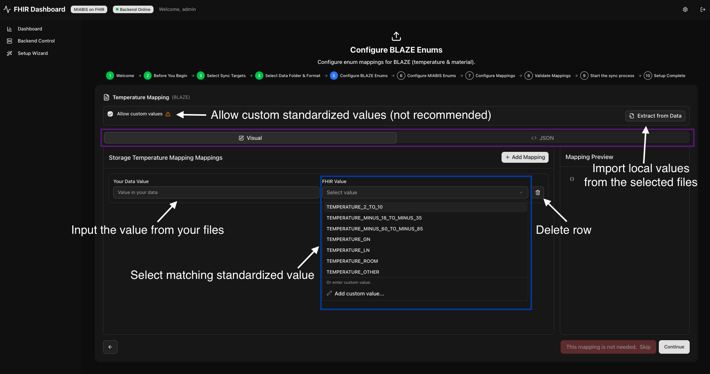

#### Extract values from data
The functionality allows the user to select one or multiple paths, from which the `Your Data Value` fields will be populated, so the user does not have to know what all values need to be mapped.
**! IMPORTANT !**
The extract functionality provides a best effort service. This is due to performance constraints.Only up to 1000 files from the import folder will be processed, and values from those extracted. Based on the value distribution and count, the extraction result might or might not be complete. Manual check is always required after this.

### Type to collection mapping
After the enum mappings are defined, it is needed to specify how the records are divided to defined collections. This is done in a similar way as the enum mappings, the only difference is the user must know both what value specifies the collection and the name of the collection.

The value on the left side (the one found in the imported files) should be predictable - for example diagnosis is a bad example, since the order of the diagnoses in the file is not given and the whole value defines the collection. Let us have samples with diagnoses:

- D001
- D001, D002
- D002, D001

For this trio, all three combinations would need to be mapped to a collection, since they are "not the same" from the viewpoint of the system.

A good examples on the other hand would be material type, or storage temperature, where each sample maps always to only one of those.

The collection names are the ones found in the file the system administrator linked using the `shared_config.json` into the fhir-module.

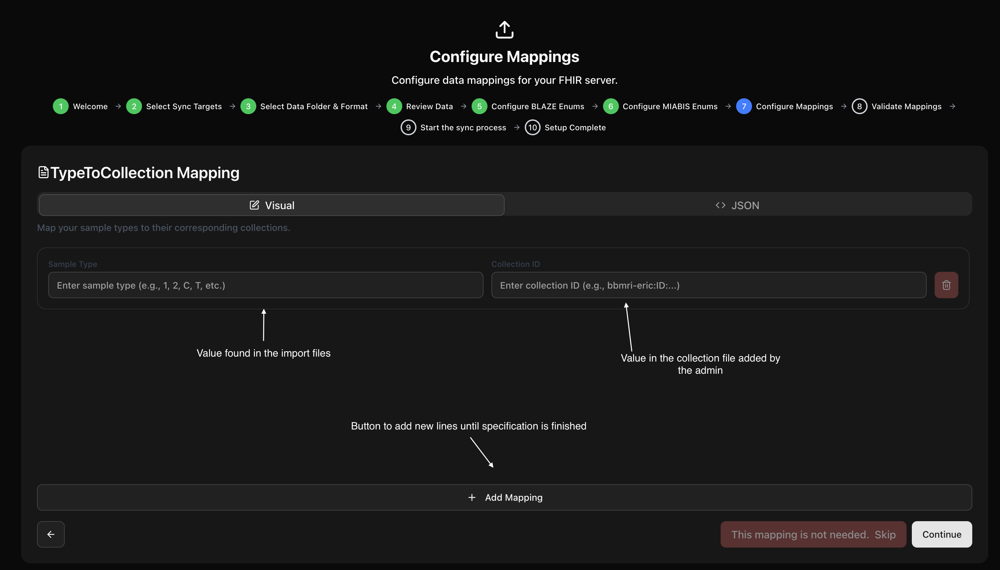

### Donor, Condition, Sample mappings
The mappings for the donor, condition and sample are very similar to the enum / collection ones. The only difference is the values that have to be defined are pre-specified, the user must only define the path to the value (in the file). The system parses the first file, and offers the user the values found in it. The user only selects which one of the found values defines the given concept (name, ID, sex, diagnosis,...)

In the case of CSV it is important the delimiter was defined correctly in the folder selection step, otherwise the system will not recognize the columns and will not be able to offer the existing paths.

The only specifics comes from the XML files, where

- attribute of the path/tag can be selected -> **Use Attribute**
- the user can define a wildcard path to select multiple elements in the file -> **Find everywhere**
- the user can define that the value is found in the children of the element -> **Iterate sub-elements**
- select multiple paths for the value -> connection with **||**

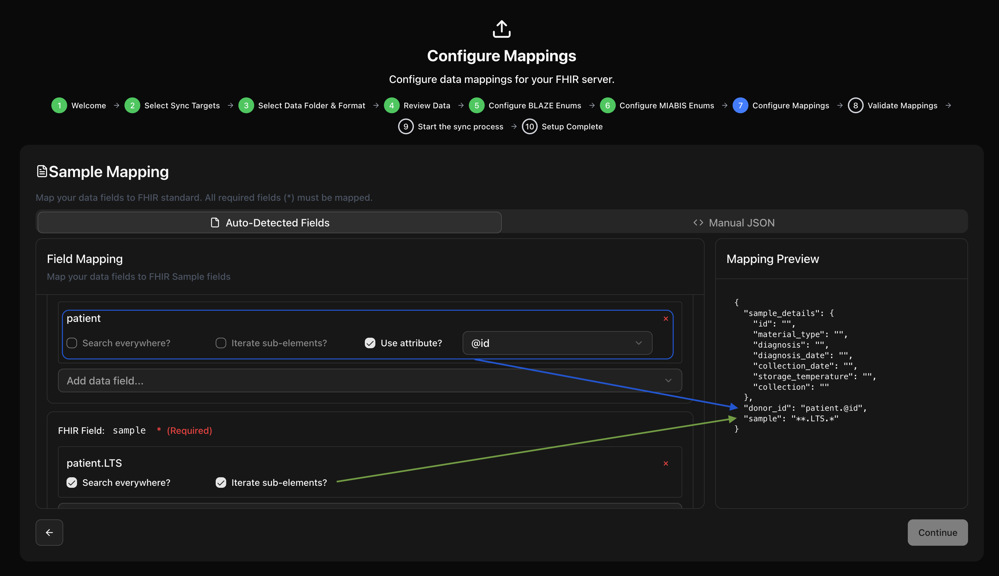

#### XML and Sample definition
The process of sample mapping in case of XML is specific compared to the CSV and JSON. It is first required to specify the path to the sample in the XML file, this will most likely be done using a wildcard.

- Find everywhere allows you to select all occurrences of the path in the file - `**.LTS` will match here both the `<LTS>` tags.
- Iterate sub-elements tells the system, that whatever is being defined (probably path to sample) is found in the children of the tag this is specified on. In this case, that would be both `<tissue>` and `<otherNameForTissue>`

```XML
<?xml version="1.0" ?>
<patient biobank="MOU" consent="true" id="0" month="--10" sex="other" year="1948">
  <LTS>
    <tissue year="2020" number="8268990225" sampleId="BBM:2020:8268990225:1">
      <samplesNo>1840584165</samplesNo>
      <availableSamplesNo>1840584165</availableSamplesNo>
      <materialType>whole-blood</materialType>
      <pTNM>T4bN1M</pTNM>
      <morphology>8500/32</morphology>
      <diagnosis>C445</diagnosis>
      <cutTime>2026-05-15T03:05:00</cutTime>
      <freezeTime>2025-11-21T04:36:17</freezeTime>
      <retrieved>operational</retrieved>
    </tissue>
    <otherNameForTissue year="2018" number="6952064835" sampleId="BBM:2018:6952064835:1">
      <samplesNo>4039594220</samplesNo>
      <availableSamplesNo>4039594220</availableSamplesNo>
      <materialType>urine</materialType>
      <pTNM>T4bN1M</pTNM>
      <morphology>8500/32</morphology>
      <diagnosis>C490</diagnosis>
      <cutTime>2016-09-05T19:38:36</cutTime>
      <freezeTime>2016-11-08T01:23:41</freezeTime>
      <retrieved>operational</retrieved>
    </otherNameForTissue>
  </LTS>
    <LTS>
    <tissue year="2020" number="8268990225" sampleId="BBM:2020:8268990225:1">
      <samplesNo>1840584165</samplesNo>
      <availableSamplesNo>1840584165</availableSamplesNo>
      <materialType>whole-blood</materialType>
      <pTNM>T4bN1M</pTNM>
      <morphology>8500/32</morphology>
      <diagnosis>C445</diagnosis>
      <cutTime>2026-05-15T03:05:00</cutTime>
      <freezeTime>2025-11-21T04:36:17</freezeTime>
      <retrieved>operational</retrieved>
    </tissue>
    <otherNameForTissue year="2018" number="6952064835" sampleId="BBM:2018:6952064835:1">
      <samplesNo>4039594220</samplesNo>
      <availableSamplesNo>4039594220</availableSamplesNo>
      <materialType>urine</materialType>
      <pTNM>T4bN1M</pTNM>
      <morphology>8500/32</morphology>
      <diagnosis>C490</diagnosis>
      <cutTime>2016-09-05T19:38:36</cutTime>
      <freezeTime>2016-11-08T01:23:41</freezeTime>
      <retrieved>operational</retrieved>
    </otherNameForTissue>
  </LTS>
</patient>
```
Once the path to the sample is defined, the details of the sample can be specified. **Keep in mind that all the paths within the `sample_details` will be derived from the specification of the path to the sample itself.**

See the picture below:

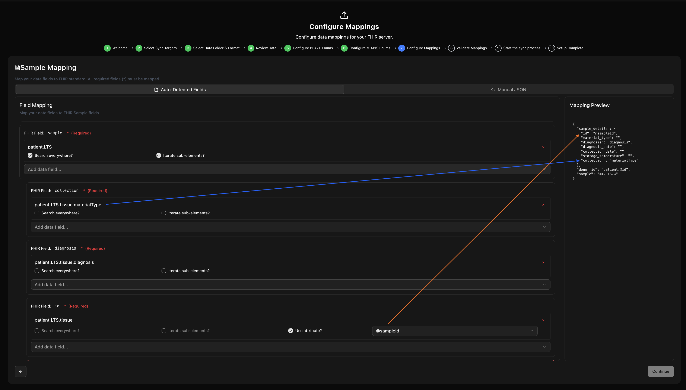

- As the sample path is defined as the `**.LTS.*` the system matches the **tissue** as the children (in the example there is no `otherNameForTissue` as that was only for demonstration purposes)
- The paths to the values omit the `patient.LTS.tissue` part of the path, as that is defined by the `**.LTS.*`

### Mapping validation

Before the sync operation can commence, the smoke validation of the defined schemas needs to be done. the validation step checks if all required values are mapped and if the enum mappings contain the values found in the imported files.

User can either perform a quick validation of only a single file, or opt for a full validation of the folder that is being imported. **IMPORTANT** same as in the case of the ENUM value export from the files, the full validation provides a best effort service. Only up to 1000 imported files will be checked, since the full check of the imported folder might not be possible (if it contains too many files). 

Based on how the system is configured, both the standard blaze and MIABIS must pass co continue.

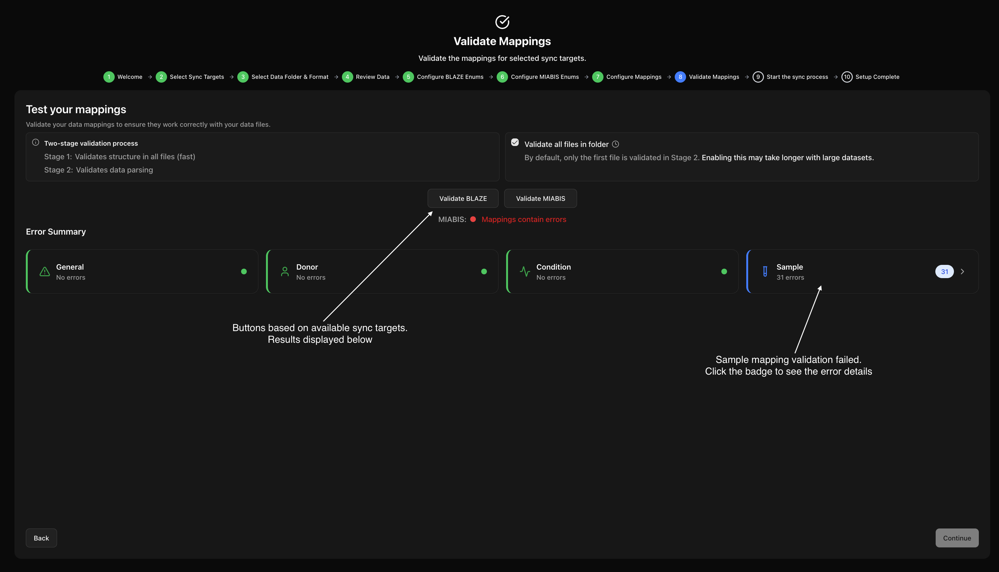

### Sync page
The last step is to apply the created mappings and optionally trigger the sync process. This is done by pressing the respective button. The dashboard will now show details regarding the counts of entities in the blaze databases.

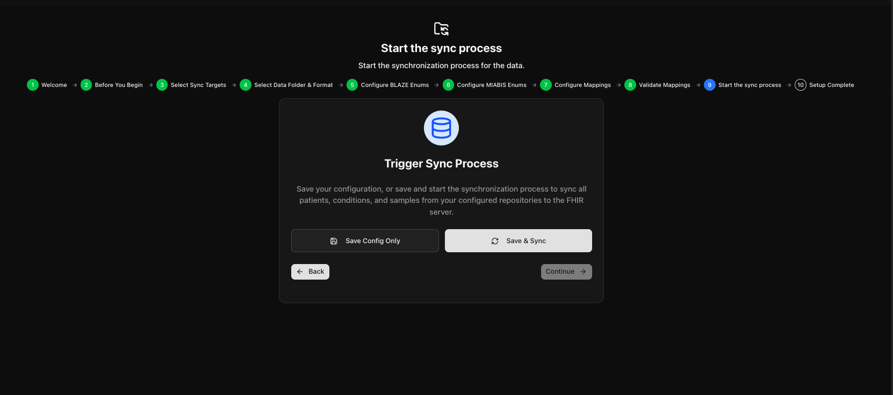

## Backend management page

Lastly to mention the backend management page. This serves the purpose of manually triggering the sync and delete operations. The visible options again depend on what targets are reachable based on the fhir module configuration.

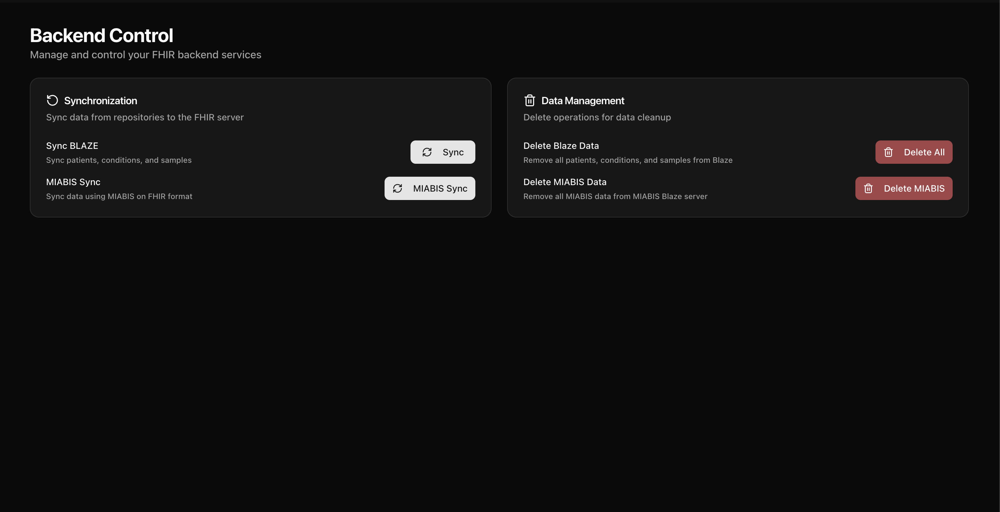